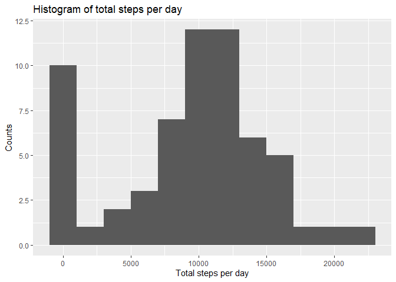
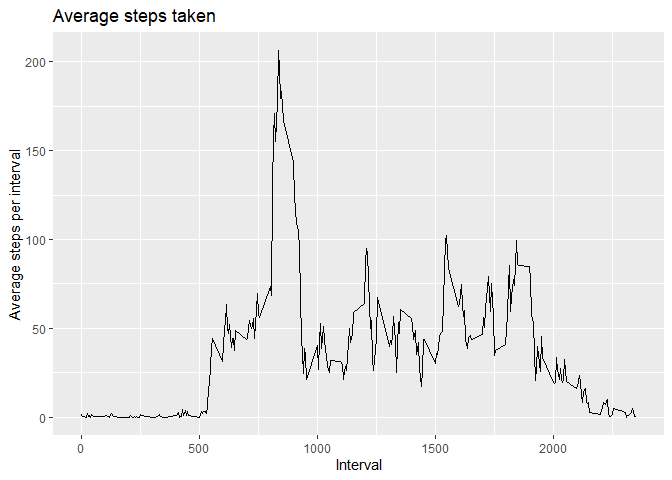
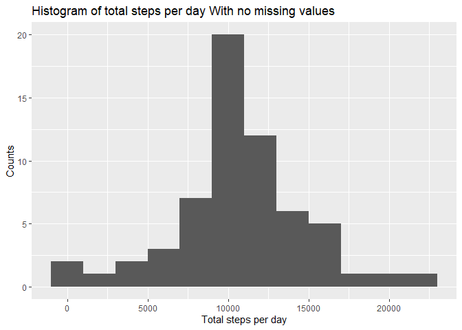
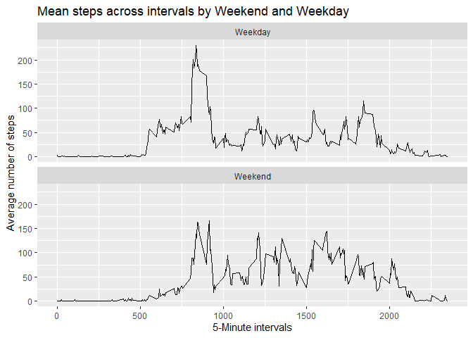

Course Project 1 - Reproducible Research
================
Ibrahim Ali
June 11, 2022

\##Assignment Instructions

1.Code for reading in the dataset and/or processing the data
2.Histogram of the total number of steps taken each day
3.Mean and median number ofsteps taken each day 
4.Time series plot of the average number of steps taken 
5.The 5-minute interval that, on average, contains the maximum number of steps 
6.Code to describe and show a strategy for imputing missing data 
7.Histogram of the total number of steps taken each day after missing values are imputed 
8.Panel plot comparing the average number of steps taken per 5-minute interval across weekdays and weekends
9.All of the R code needed to reproduce the results (numbers, plots, etc.) in the report

# Step 1

## Code for reading in the dataset and/or processing the data

``` r
library(lubridate)
```

    ## 
    ## Attaching package: 'lubridate'

    ## The following objects are masked from 'package:base':
    ## 
    ##     date, intersect, setdiff, union

``` r
library(ggplot2)
library(dplyr)
```

    ## 
    ## Attaching package: 'dplyr'

    ## The following objects are masked from 'package:stats':
    ## 
    ##     filter, lag

    ## The following objects are masked from 'package:base':
    ## 
    ##     intersect, setdiff, setequal, union

``` r
library(knitr)
setwd("C:/Users/HiKa8/Desktop/R coursera/Reproducible research/project 1")
data<-read.csv("activity.csv")
```

## Exploring the basics of this data

``` r
dim(data)
```

    ## [1] 17568     3

``` r
names(data)
```

    ## [1] "steps"    "date"     "interval"

``` r
head(data)
```

    ##   steps       date interval
    ## 1    NA 2012-10-01        0
    ## 2    NA 2012-10-01        5
    ## 3    NA 2012-10-01       10
    ## 4    NA 2012-10-01       15
    ## 5    NA 2012-10-01       20
    ## 6    NA 2012-10-01       25

``` r
str(data)
```

    ## 'data.frame':    17568 obs. of  3 variables:
    ##  $ steps   : int  NA NA NA NA NA NA NA NA NA NA ...
    ##  $ date    : chr  "2012-10-01" "2012-10-01" "2012-10-01" "2012-10-01" ...
    ##  $ interval: int  0 5 10 15 20 25 30 35 40 45 ...

``` r
## Total number of missing data
summary(data)
```

    ##      steps            date              interval     
    ##  Min.   :  0.00   Length:17568       Min.   :   0.0  
    ##  1st Qu.:  0.00   Class :character   1st Qu.: 588.8  
    ##  Median :  0.00   Mode  :character   Median :1177.5  
    ##  Mean   : 37.38                      Mean   :1177.5  
    ##  3rd Qu.: 12.00                      3rd Qu.:1766.2  
    ##  Max.   :806.00                      Max.   :2355.0  
    ##  NA's   :2304

# Step 2

## Histogram of the total number of steps taken each day

``` r
### Calculate the total number of steps taken each day by grouping the data by date
data_by_date <- data %>% group_by(date) %>%
        summarize(total_steps_per_day = sum(steps, na.rm = TRUE))

### Histogram of total steps
ggplot(data_by_date, aes(total_steps_per_day)) +
    geom_histogram(binwidth = 2000)+
    ggtitle("Histogram of total steps per day")+
    xlab("Total steps per day")+
    ylab("Counts")
```

<!-- -->

## Step 3 
## Calculate Mean and median number of steps taken each day

``` r
mean <- mean(data_by_date$total_steps_per_day, na.rm = TRUE)
median <- median(data_by_date$total_steps_per_day, na.rm = TRUE)
paste("The mean is", mean)
```

    ## [1] "The mean is 9354.22950819672"

``` r
paste("The median is", median)
```

    ## [1] "The median is 10395"

# Step 4

## Time series plot of the average number of steps taken per interval

``` r
data_by_interval <- data %>% group_by(interval) %>%
    summarize(avg_steps_per_interval = mean(steps, na.rm = TRUE))
ggplot(data_by_interval,aes(x = interval, y = avg_steps_per_interval))+
    geom_line()+
    ylab("Average steps per interval")+
    xlab("Interval")+
    ggtitle("Average steps taken")
```

<!-- -->

# Step 4

## Code to describe and show a strategy for imputing missing data with Mean value substitutions

``` r
imputed_data <- data %>%
mutate(
steps = case_when(
    is.na(steps) ~ data_by_interval$avg_steps_per_interval[match(data$interval, data_by_interval$interval)],      
    TRUE ~ as.numeric(steps)))
### count the missing data
missing <- !complete.cases(data)
summary(missing)
```

    ##    Mode   FALSE    TRUE 
    ## logical   15264    2304

# Step 5

## Histogram of the total number of steps taken each day after missing values are imputed

``` r
data_by_date2 <- imputed_data %>% group_by(date) %>%
    summarize(total_steps_per_day = sum(steps, na.rm = TRUE))
ggplot(data_by_date2, aes(total_steps_per_day)) +
    geom_histogram(binwidth = 2000)+
    ggtitle("Histogram of total steps per day With no missing values")+
    xlab("Total steps per day")+
    ylab("Counts")
```

<!-- -->

``` r
### Reporting the mean and median after removing the missing values
mean2 <- mean(data_by_date2$total_steps_per_day, na.rm = TRUE)
median2 <- median(data_by_date2$total_steps_per_day, na.rm = TRUE)
paste("The mean is", mean2)
```

    ## [1] "The mean is 10766.1886792453"

``` r
paste("The median is", median2)
```

    ## [1] "The median is 10766.1886792453"

# Step 6

## Panel plot comparing the average number of steps taken per 5-minute interval across weekdays and weekends

``` r
day_of_week <- imputed_data %>%
    mutate(date = ymd(date),
            weekday_or_weekend = case_when(
                wday(date) %in% 2:6 ~ "Weekday",
                wday(date) %in% c(1,7) ~ "Weekend")) %>% 
                    select(-date) %>%
                    group_by(interval, weekday_or_weekend) %>%
                    summarise(steps = mean(steps))
```

    ## `summarise()` has grouped output by 'interval'. You can override using the
    ## `.groups` argument.

``` r
ggplot(day_of_week, aes(interval, steps)) + 
    geom_line() + 
    facet_wrap(~weekday_or_weekend, nrow = 2) +
    xlab("5-Minute intervals") + 
    ylab("Average number of steps")+
    ggtitle("Mean steps across intervals by Weekend and Weekday")
```

<!-- -->
